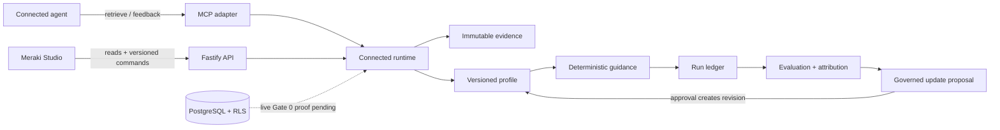
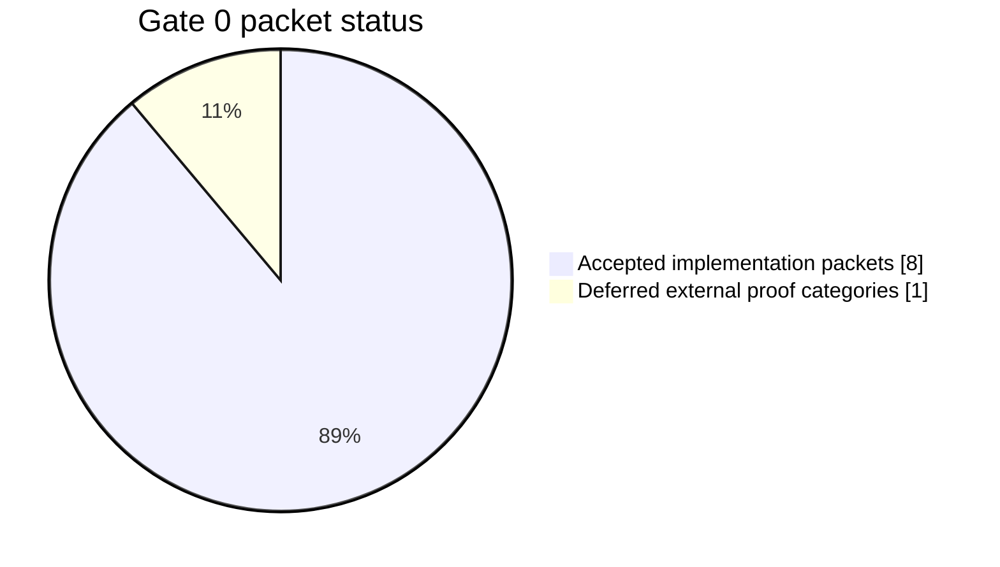

# Meraki Core documentation

This directory is the repository wiki. It explains the product, the build, the contracts, and the evidence required to call a gate complete.

## Choose a path

| Reader | Start here | Then read |
| --- | --- | --- |
| New contributor | [Build and release](build-and-release.md) | [Architecture](architecture.md), [Contracts](contracts.md) |
| Product or design | [What Meraki is](what-meraki-is.md) | [How it works](how-it-works.md), [Evaluation and rollback](evaluation-and-rollback.md) |
| Security reviewer | [Security review](security-review.md) | [Evidence and change](evidence-and-change.md), [Completion audit](completion-audit.md) |
| Gate reviewer | [Completion audit](completion-audit.md) | `ops/proof/G0-manifest.yaml`, `config/execution_graph.yaml` |

## System map

The dotted database edge is intentional. The adapter-backed vertical slice and JSON restart store are tested, but the final PostgreSQL gate remains deferred. The graph does not imply acceptance.

## Gate status

All eight implementation packets are recorded as accepted. Gate 0 itself is **not accepted** because its live PostgreSQL 16, pgvector, RLS, concurrency, independent-connection, and restart proof still needs an independent `ACCEPT`.
