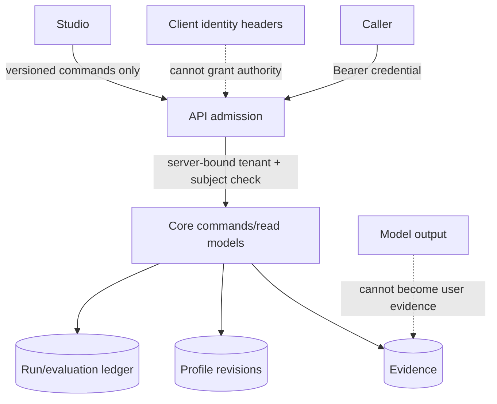

# Security review

Review date: 2026-07-26. Scope: repository code and configuration at the Gate 0 continuation point. This is an engineering review, not a penetration test or production certification.

## Executive result

The review found one high-risk deployment flaw: the HTTP API checked tenant and subject headers against process configuration but did not authenticate the caller. Anyone who knew those values could read traces or issue commands. The API now fails closed outside tests unless `MERAKI_API_TOKEN` contains at least 32 characters and requires an exact bearer credential before checking server-bound identity.

Gate 0 remains **not accepted**. The previous Devin PR (#2) repaired formatting and the static gate, but the repository still records live PostgreSQL and independent review evidence as deferred. Documentation and an authentication repair do not satisfy that missing proof.

## Findings

| ID | Severity | Finding | Status |
| --- | --- | --- | --- |
| SEC-001 | High | Identity headers were treated as sufficient request admission even though headers are client-controlled. | Fixed: bearer credential required; identity remains server-bound. |
| SEC-002 | High | Live forced-RLS, cross-tenant/cross-subject, concurrent-idempotency, and restart behavior lacks accepted external evidence. | Open gate blocker; test only on a disposable PostgreSQL 16 + pgvector runtime. |
| SEC-003 | Medium | One process authority represents one tenant/subject and uses a shared bearer secret; there is no production identity-provider, token expiry, or per-principal scope derivation. | Open deployment limitation. Do not market as multi-user production auth. |
| SEC-004 | Medium | API hardening such as TLS termination, rate limiting, request-size policy, audit export, and secret rotation is not supplied as deployable infrastructure. | Open before public hosting. |
| SEC-005 | Medium | The local Docker database publishes port 5432 and uses a documented development password. | Accepted for disposable local use only; never reuse in hosted environments. |

## Trust boundary

## Required follow-up before public deployment

1. Replace the single shared secret with authenticated sessions or scoped, expiring service credentials issued by an identity provider.
2. Derive tenant, subject, actor, session, and scopes from verified claims; never merge payload or identity-header authority.
3. Complete the deferred database proof and obtain an independent `ACCEPT`.
4. Add reverse-proxy TLS, request limits, rate limits, secret rotation, structured security logs, and restore drills.
5. Run dependency, secret, container, and dynamic API scanning in CI with an explicit triage policy.

## Verification focus

Regression tests cover missing, incorrect, and correct bearer credentials; tenant tampering; scope checks; prompt-injection quarantine; and live database tests when `DATABASE_URL` is available. The completion audit remains the authoritative summary of what is demonstrated versus merely present.
