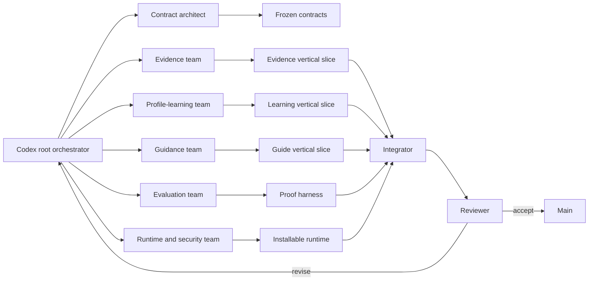

# Meraki Core — Codex Execution Plan

This package is an execution graph for Codex and a coordinated engineering-agent team. It is not a calendar.

The objective is to build a runtime-independent mechanism that:

1. observes user activity and explicit feedback;
2. separates raw evidence from interpretation;
3. learns facts, preferences, behavioral patterns, judgment criteria, modes, voice, workflows, goals, and current state;
4. scopes every learned claim by context and time;
5. compiles only relevant guidance into an agent run;
6. measures whether the guidance improved the result;
7. updates its model through governed, reversible feedback loops;
8. reduces repeated correction burden over related tasks.

## Critical meaning of “self-improving”

In Meraki v0, self-improvement means:

- profile atoms gain, lose, or change scope through evidence;
- modes become better calibrated;
- retrieval utility changes from measured outcomes;
- context packs improve;
- the agent stops repeating demonstrated mistakes;
- the system asks targeted questions when uncertainty is high.

It does **not** mean:

- agents silently rewrite production code;
- model outputs train themselves without user evidence;
- a model invents personality claims;
- automatic base-model fine-tuning;
- unconstrained autonomous optimization.

## Execution model



## Build order

The system is built through dependency gates, not dates:

1. **Gate 0 — Control plane**
2. **Gate 1 — Explicit-correction vertical slice**
3. **Gate 2 — Evidence and extraction**
4. **Gate 3 — Profile, modes, and lifecycle**
5. **Gate 4 — Retrieval and context compilation**
6. **Gate 5 — Runtime and run ledger**
7. **Gate 6 — Evaluation and governed learning**
8. **Gate 7 — Longitudinal dogfood proof**
9. **Gate 8 — Clean installation and release**

Every gate ends in executable proof. No team may complete a “layer” that has never participated in the full loop.

## Core loop

```text
source
→ immutable event
→ direct observation
→ aggregated signal
→ falsifiable hypothesis
→ versioned profile atom
→ task and mode resolution
→ candidate retrieval
→ deterministic Meraki Pack
→ agent run
→ user correction / choice / outcome
→ evaluation and attribution
→ update proposal
→ changed future pack
```

## Repository target

```text
meraki-core/
  apps/
    api/
    worker/
    mcp/
    cli/
  packages/
    contracts/
    domain/
    db/
    evidence/
    learning/
    profile/
    guidance/
    evaluation/
    providers/
    security/
    test-fixtures/
  examples/
    pratham-dogfood/
  ops/
    orchestration/
    proof/
```

## Start command for Codex

Give Codex `prompts/CODEX_ROOT_ORCHESTRATOR.md`, then tell it:

```text
Execute Gate 0 only. Do not begin Gate 1 until the Gate 0 reviewer returns ACCEPT.
Maintain ops/orchestration/state.json and ops/orchestration/decision-log.md.
Spawn bounded subagents from config/work_packets.yaml.
```

## Meraki Studio addition

The foundation now includes an internal IDE-like application:

```text
apps/studio
```

Studio is a first-class verification and control layer. It exposes the profile graph, evidence lineage, connected agents, packs, runs, evaluations, update proposals, sources, and goals.

The persistent execution goal is defined in:

- `GOAL.md`
- `config/goal.yaml`

The root orchestrator must create the same goal in Codex's native Goal feature when that feature is available, while keeping the repository goal contract canonical.
