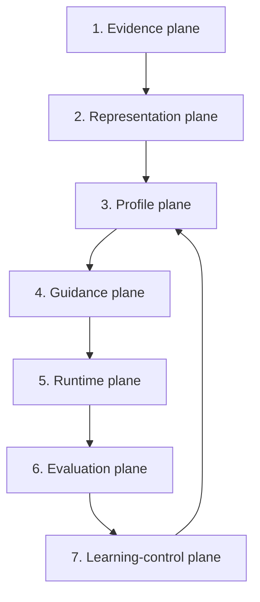

# System architecture

## Seven planes



## Plane 1 — Evidence

Canonical truth:

- source records;
- immutable events;
- artifacts;
- edits/diffs;
- choices;
- feedback;
- outcomes;
- consent;
- provenance.

No personality claims live here.

## Plane 2 — Representation

Transforms evidence into:

- direct observations;
- deterministic features;
- multimodal features;
- aggregated signals;
- episodes;
- candidate hypotheses.

This plane contains uncertainty.

## Plane 3 — Profile

Stores versioned, typed profile atoms across:

- facts;
- current state;
- goals;
- identity declarations;
- behavior;
- cognitive working patterns;
- communication;
- voice;
- taste;
- judgment;
- workflow;
- exemplars;
- anti-patterns;
- modes;
- uncertainty.

Every atom has:

- evidence;
- counterevidence;
- scope;
- mode;
- temporal horizon;
- confidence;
- utility;
- lifecycle;
- sensitivity;
- version.

## Plane 4 — Guidance

For a task:

1. analyze task;
2. resolve user/workspace/project/mode;
3. retrieve candidates;
4. exclude unsafe, stale, revoked, or wrong-scope atoms;
5. resolve conflicts;
6. rerank for expected utility;
7. compile a deterministic pack;
8. preserve provenance and uncertainty.

## Plane 5 — Runtime

Adapters:

- REST;
- TypeScript SDK;
- MCP;
- CLI;
- future IDE and application middleware.

The runtime may request guidance and record feedback. It cannot write active profile atoms directly.

## Plane 6 — Evaluation

Measures:

- extraction quality;
- profile correctness;
- retrieval quality;
- mode resolution;
- pack quality;
- output quality;
- correction burden;
- preference prediction;
- voice match;
- cost and latency;
- safety.

## Plane 7 — Learning control

Produces governed changes:

- reinforce;
- weaken;
- rescope;
- split;
- merge;
- supersede;
- expire;
- revoke;
- request confirmation;
- request more evidence;
- adjust retrieval utility.

All changes are versioned and reversible.

## Shared plus residual model

```text
representation =
shared behavioral features
+ user residual
+ workspace residual
+ project residual
+ mode residual
+ current state
```

In v0 these are structured data and scoring functions. Later they may become learned embeddings or adapters.

## Data authority order

1. explicit current user instruction;
2. objective task outcome;
3. explicit correction or edit;
4. explicit pairwise choice with reason;
5. confirmed profile atom;
6. repeated observed behavior;
7. implicit behavior;
8. model inference;
9. generic prior.

## Scope precedence

```text
run > task > project > mode > domain > workspace > relationship > user > team
```

A narrower applicable rule overrides a broad conflicting rule.

## Memory lifecycle

```text
candidate
→ active
→ stable
→ locked_core

active/stable
→ dormant
→ superseded
→ revoked
→ unsupported
```

Only explicit user action can create `locked_core` in the foundation build.

## Plane 8 — Studio control and observability

Meraki Studio sits over public API/read-model boundaries.

It provides:

- focused profile graph;
- atom and evidence inspection;
- agent connectivity;
- run and pack traces;
- evaluation experiments;
- learning approval;
- source and goal control.

Studio is not canonical storage. It is a projection and command surface.

```text
apps/studio
→ generated API client
→ Studio read models + versioned commands
→ domain services
```
