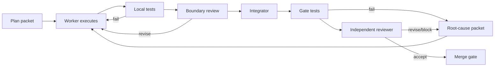

# Engineering-agent operating system

## Team topology

### Codex root — orchestrator and integrator

Owns:

- task DAG;
- WIP;
- worktree creation;
- dependency resolution;
- context packets;
- merge order;
- gate evidence;
- decision log;
- release state.

It should not perform large implementation work unless integration requires it.

### Principal architect — strongest reasoning model

Owns:

- contracts;
- ontology;
- public APIs;
- invariants;
- architecture decisions;
- cross-layer review;
- conflict resolution.

It may write schemas and interfaces but should avoid bulk implementation.

### Reviewer — strongest independent model

Owns:

- adversarial review;
- contract drift;
- missing tests;
- security;
- causal proof;
- accept/revise/block verdict.

The reviewer must not be the same context that implemented the packet.

### Integrator — strong coding model

Owns:

- rebasing;
- resolving mechanical conflicts;
- running complete gates;
- preserving contracts;
- creating merge commits;
- updating proof manifests.

### Cheap worker pool

Bounded roles:

- schema worker;
- migration worker;
- repository worker;
- deterministic extractor worker;
- fixture worker;
- API worker;
- test worker;
- documentation worker;
- observability worker.

Cheap workers execute a packet with exact file allowlists and acceptance commands. They do not redesign.

### Specialized workers

Use stronger execution models for:

- lifecycle logic;
- retrieval/reranking;
- evaluation and attribution;
- deletion lineage;
- security boundaries;
- multimodal representation.

## WIP limits

At most:

- 1 architecture-changing packet;
- 2 implementation packets per package;
- 1 integration packet;
- 1 reviewer packet per gate.

No more than four active worktrees unless the orchestrator can state the merge order.

## Task packet contract

Every subagent receives:

```yaml
id:
objective:
gate:
depends_on:
allowed_files:
forbidden_files:
inputs:
outputs:
invariants:
acceptance_commands:
fixtures:
known_risks:
stop_conditions:
```

A task without `allowed_files` and `acceptance_commands` is not assignable.

## Worktree protocol

```text
main
gate/<gate-id>
agent/<packet-id>
review/<gate-id>
```

Workers commit to `agent/<packet-id>`. Integrator cherry-picks into the gate branch. Only an accepted gate merges to main.

## Contract freeze states

### Experimental

Schemas may change. No parallel implementation.

### Core frozen

Fields and semantics are fixed for the current gate. Additive changes require architect approval.

### Release frozen

Only fixes, migrations, tests, and documentation. No new semantics.

## Execution loop



## Reviewer verdict

```yaml
verdict: ACCEPT | REVISE | BLOCK
contract_drift: []
correctness_failures: []
missing_tests: []
security_failures: []
causal_proof_failures: []
performance_risks: []
required_changes: []
optional_changes: []
evidence_reviewed: []
```

## Context packets

Do not dump the whole repository into each worker.

Worker context contains:

- task contract;
- relevant schemas;
- relevant interfaces;
- relevant ADRs;
- exact fixtures;
- current gate state;
- allowed files;
- recent decisions affecting the packet.

## Model routing

Use expensive/strong models for:

- architecture;
- ontology;
- lifecycle;
- retrieval;
- evaluation;
- security;
- review.

Use cheap models for:

- scaffolding;
- repetitive adapters;
- fixtures;
- straightforward endpoints;
- generated types;
- documentation synchronization;
- mechanical tests.

## Stop conditions

A worker stops and reports rather than guessing when:

- contracts conflict;
- a required type is absent;
- migration semantics are unclear;
- a test requires changing forbidden files;
- scope expands;
- a security invariant cannot be preserved;
- a model output is being treated as evidence without authority.

## Orchestration state

Codex maintains:

```json
{
  "current_gate": "G1",
  "contract_state": "core_frozen",
  "active_packets": [],
  "blocked_packets": [],
  "accepted_packets": [],
  "open_decisions": [],
  "gate_evidence": [],
  "regressions": [],
  "next_merge_order": []
}
```

## Decision log

Every architecture decision records:

- problem;
- alternatives;
- decision;
- consequences;
- affected contracts;
- migration impact;
- review status.

## Efficient back-and-forth

The system should not wait until a layer is “finished.”

For every packet:

1. worker creates the smallest passing implementation;
2. evaluator runs targeted tests;
3. reviewer identifies failure class;
4. orchestrator creates a bounded patch packet;
5. worker patches;
6. regression is added;
7. integrator reruns the gate.

This is the implementation feedback loop mirroring Meraki’s product loop.

## Goal-state enforcement

The root orchestrator must load `GOAL.md` before planning any packet.

When the runtime offers a native Goal feature:

1. create the goal from `GOAL.md`;
2. attach gate milestones;
3. keep the goal active until the completion conditions pass;
4. do not let worker completion messages mark the goal complete;
5. require proof-manifest evidence.

Every worker packet includes:

```yaml
goal_id: meraki-core-studio-foundation
goal_relevance:
completion_evidence:
```

## Studio team

Add:

- Studio architect;
- graph engineer;
- profile UX engineer;
- observability engineer;
- evaluation UX engineer;
- UI systems workers;
- independent Studio reviewer.

The UI team receives read-model and command contracts, not database access.
