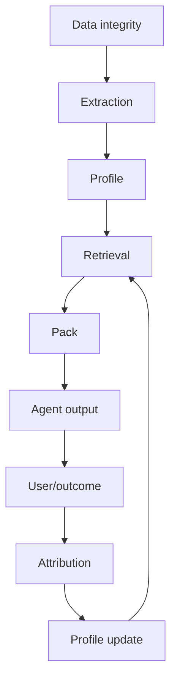

# Evaluation and improvement operating system

## Evaluation stack



A good final output cannot excuse a broken profile. Each layer is evaluated independently.

## 1. Data integrity

Tests:

- event immutability;
- source hashes;
- order;
- actor identity;
- deduplication;
- consent;
- tenant isolation;
- deletion lineage.

## 2. Extraction

Metrics:

- observation precision;
- evidence-span precision;
- scope accuracy;
- facet accuracy;
- unsupported-motive rate;
- sensitive-inference violations;
- inter-extractor consistency.

Test classes:

- golden examples;
- adversarial wording;
- paraphrase;
- duplicate source;
- model-generated text;
- third-party claims;
- ambiguous feedback.

## 3. Profile

Tests:

- temporary state never becomes durable identity;
- project rule never becomes global without evidence;
- conflict creates split or uncertainty;
- revoked source removes support;
- mode-specific rules coexist;
- confidence is calibrated;
- profile version rollback.

## 4. Retrieval

Metrics:

- must-include recall;
- must-exclude precision;
- reciprocal rank;
- scope correctness;
- mode correctness;
- stale leakage;
- negative-control abstention;
- token efficiency.

Metamorphic tests:

- paraphrasing a task should preserve relevant retrieval;
- changing project should remove project-local atoms;
- changing mode should alter communication atoms;
- adding irrelevant source should not alter pack;
- revoking an atom must alter pack;
- changing evidence order must not alter pack.

## 5. Pack

Tests:

- deterministic bytes and hash;
- authority order;
- hard constraints verbatim;
- no conflicts;
- no revoked atoms;
- provenance complete;
- token budget;
- uncertainty visible.

## 6. Output

Use user and objective outcomes first.

Writing:

- blind preference;
- correction count;
- banned phrase;
- voice fit;
- factual correctness;
- argument quality.

Coding:

- tests;
- static analysis;
- repository constraints;
- review corrections;
- architecture conformance.

Creative:

- pairwise choice;
- criterion-level scores;
- brief fidelity;
- visual judgment reasons;
- originality and brand fit.

Brainstorming:

- novelty;
- relevance;
- constraint fit;
- chosen-idea rate;
- convergence efficiency.

## 7. Longitudinal improvement

For recurring task family `T`:

```text
repeated_error_rate(T, n)
correction_burden(T, n)
time_to_accept(T, n)
guided_win_rate(T, n)
```

The desired curve is lower correction burden and repeated error over successive runs.

## 8. Causal proof

A guided output can improve simply because it received more tokens. Required controls:

### Baseline

No Meraki Pack.

### Raw-memory control

Receives an equal-token dump of raw memories.

### Meraki Pack

Receives compiled guidance.

### Ablations

- remove task-local atoms;
- remove mode;
- remove anti-patterns;
- remove examples;
- remove utility reranking;
- replace personal preferences with population defaults.

The Meraki Pack should beat both baseline and equal-token raw memory.

## 9. Preference-model evaluation

Pairwise prediction:

```text
accuracy
log loss
Brier score
calibration curve
coverage
abstention accuracy
```

Evaluate by:

- user;
- context;
- criterion;
- time split;
- unseen artifact;
- adjacent domain.

Do not claim to know taste when the model is only confident on one context.

## 10. Mode evaluation

Frozen examples labeled:

- expected mode;
- acceptable alternatives;
- prohibited leakage.

Metrics:

- top-1;
- top-2;
- confidence;
- leakage rate.

## 11. Voice evaluation

Use:

- user blind choice;
- style-feature adherence;
- banned-pattern checks;
- exemplar similarity;
- factual-grounding checks.

Do not use one generic LLM judge as the authority.

## 12. Self-improvement safety

Required tests:

- agent output cannot become user evidence;
- negative user outcome cannot indiscriminately weaken every atom;
- confidence delta is capped;
- model judge cannot promote;
- update proposal is reversible;
- unrelated packs remain unchanged;
- repeated identical evidence counts as one source;
- evaluator and generator model preferences do not create a closed style loop.

## 13. Active-learning loop

When uncertainty affects a high-value repeated workflow:

1. generate candidate question;
2. estimate information gain;
3. compare interruption cost;
4. ask only the highest-value question;
5. store answer as explicit evidence;
6. recompute hypotheses;
7. test prediction later.

## 14. Error-driven improvement loop

```text
failure
→ classify layer
→ create smallest reproducible fixture
→ patch only responsible module
→ add regression
→ rerun component gate
→ rerun full vertical slice
→ update decision log
```

Never patch prompts blindly when the failure is actually scope or evidence corruption.

## 15. Release scorecard

Required foundation thresholds:

- unsupported active atoms: 0 in audited dogfood set;
- sensitive inference violations: 0;
- tenant leakage: 0;
- mandatory retrieval recall: 100% on frozen small suite;
- final pack precision: >= 0.80;
- deterministic pack hashes: 100%;
- negative-control abstention: >= 0.90;
- model-output-as-user-evidence violations: 0;
- clean install: pass;
- complete end-to-end lineage: pass.

Outcome thresholds are reported with sample size and uncertainty, not presented as universal proof.
